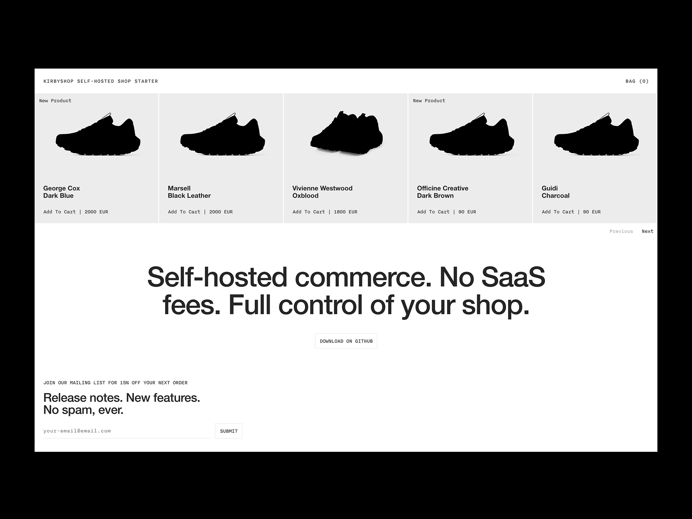

# KirbyShop

A self-hosted e-commerce starter built on [Kirby CMS](https://getkirby.com) with Stripe Checkout. Designed for developers who need to ship a cost-effective online shop for clients with moderate needs. No SaaS fees, no vendor lock-in, full control.



## Stack

- **Kirby CMS 5**: content management and routing
- **Stripe**: payment processing via Stripe Checkout
- **Vite**: asset bundling and HMR
- **PHP built-in server**: zero-config local development

## Requirements

- PHP >= 8.0
- Composer
- Node.js + npm
- Docker (alternative)

## Getting started

**1. Clone and install**

```bash
git clone <repo-url>
cd Store
composer install
npm install
```

**2. Configure environment**

```bash
cp .env-example .env
```

Fill in your Stripe keys and SMTP credentials. Set `VITE_DEV=true` for local development.

**3. Run**

```bash
npm run dev
```

This starts both the PHP server on `localhost:8888` and the Vite dev server on `localhost:5173`.

Or with Docker:

```bash
docker compose up --build
```

## Project structure

```
content/          # Kirby content (pages, shop products, orders)
public/           # Web server document root
  index.php       # Kirby entry point
  assets/         # Static assets (images, fonts)
  build/          # Compiled JS/CSS (generated)
assets/           # Source files
  js/             # JavaScript source
  scss/           # SCSS source
site/
  plugins/
    kstore/       # Custom store plugin (cart, checkout, routes)
  templates/      # Page templates (home, product, cart, checkout, success)
  snippets/       # Reusable partials (header, footer, cart-item, picture...)
  controllers/    # Page controllers
```

## Features

- **Session-based cart**: add, update, and remove items
- **Stripe Checkout**: redirect-based payment flow with stock validation
- **Manual checkout**: Stripe can be disabled from the panel to handle payment outside the app
- **Order management**: orders created as Kirby pages, manageable from the panel [(inspired by Merx)](https://github.com/wagnerwagner/merx)
- **Email notifications**: confirmation sent to buyer, summary sent to admin
- **Newsletter signup**: email collection from the footer, stored in the panel

## Environment variables

| Variable | Description |
|---|---|
| `VITE_DEV` | Set to `true` in local dev to load assets from Vite dev server |
| `STRIPE_LIVE_PUBLIC_KEY` | Stripe live publishable key |
| `STRIPE_LIVE_SECRET_KEY` | Stripe live secret key |
| `STRIPE_TEST_PUBLIC_KEY` | Stripe test publishable key |
| `STRIPE_TEST_SECRET_KEY` | Stripe test secret key |
| `EMAIL_HOST` | SMTP host |
| `EMAIL_PORT` | SMTP port |
| `EMAIL_USERNAME` | SMTP username |
| `EMAIL_PASSWORD` | SMTP password |

## Build your application

Remove `VITE_DEV` from your `.env`, then run `npm run preview` to compile the JS and SCSS files into public/build/ and start the local preview server.

```bash
npm run preview # compiles JS and SCSS into public/build/, then starts local preview
```

Deploy manually, via FTP, SSH, or your preferred method.

## Disclaimer

This setup is a work in progress and may contains bugs. Use it as you see fit.
