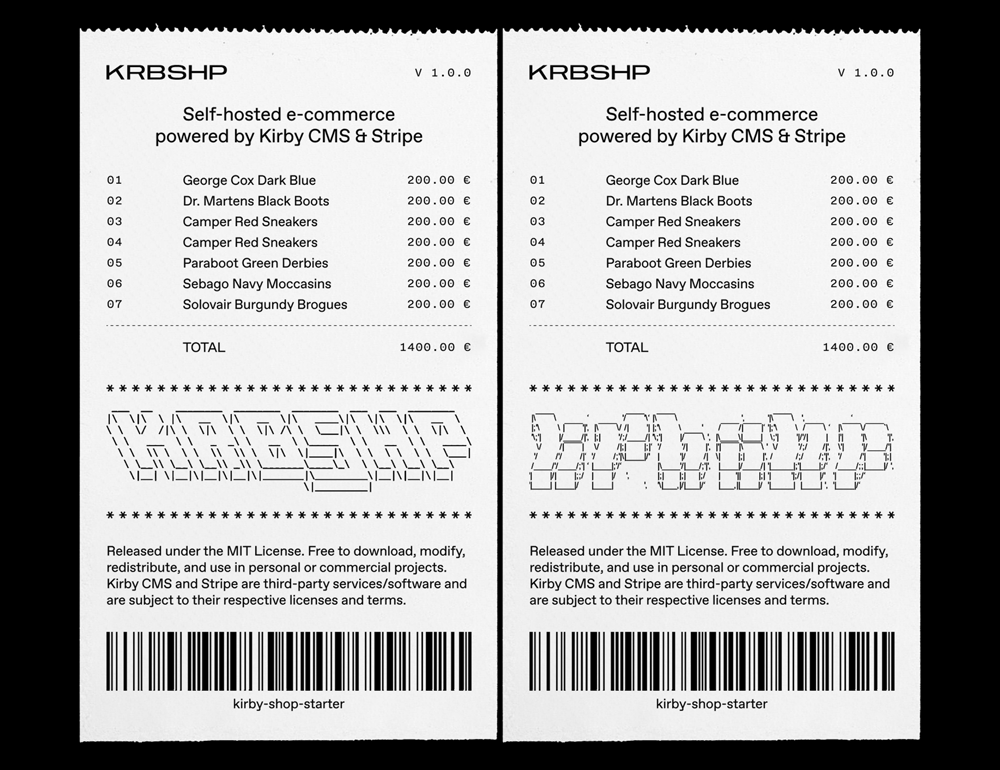

# KirbyShop

A self-hosted e-commerce starter built on [Kirby CMS](https://getkirby.com) with Stripe Checkout. Designed for developers who need to ship a cost-effective online shop for clients with moderate needs.



## Stack

- **Kirby CMS 5**: content management and routing
- **Stripe**: payment processing via Stripe Checkout
- **Vite + SCSS**: asset bundling and hot reload
- **PHP built-in server**: zero-config local development

## Requirements

- PHP >= 8.2
- Composer
- Node.js + npm
- Docker (alternative)

## Getting started

**1. Clone and install**

```bash
git clone https://github.com/ambientmoxie/kirby-shop.git
cd kirby-shop
composer install
npm install
```

**2. Configure environment**

```bash
cp .env-example .env
```

Fill in your Stripe keys and SMTP credentials. Keep `VITE_DEV=true` for local development: it loads assets from the Vite dev server, turns on Kirby's debug mode, uses the Stripe **test** keys and allows installing the panel.

**3. Run**

```bash
npm run dev
```

This starts both the PHP server on `localhost:8888` and the Vite dev server on `localhost:5173`. Open `localhost:8888/panel` to create your admin account.

Or with Docker:

```bash
docker compose up --build
```

## Project structure

```
content/            # Kirby content (home, shop products, orders)
public/             # Web server document root
  index.php         # Kirby entry point
  assets/           # Static assets (images, fonts)
  build/            # Compiled JS/CSS (generated)
assets/             # Source files
  js/               # JavaScript modules (cart, drawer, carousel, dropdown)
  scss/             # base / layout / sections / components / pages
site/
  blueprints/       # Panel forms
  controllers/      # Checkout, success and newsletter logic
  plugins/kstore/   # Store plugin: cart routes, checkout, helpers
  snippets/
    layout/         # head, header, footer
    sections/       # home page sections (hero, product list, FAQ)
    components/     # product card, cart drawer, newsletter, picture...
  templates/        # home, checkout, success + emails
```

## Features

- **Session-based cart**: add, update and remove items from a slide-over drawer. Prices and stock are always read from the product pages, never from the browser.
- **Stripe Checkout**: redirect-based payment flow with stock validation. The order is only created once Stripe confirms the payment.
- **Manual checkout**: Stripe can be disabled from the panel to handle payment outside the app
- **Order management**: orders created as Kirby pages, manageable from the panel [(inspired by Merx)](https://github.com/wagnerwagner/merx)
- **Email notifications**: confirmation sent to the buyer, summary sent to the admin
- **Newsletter signup**: email collection from the footer, stored in the panel

## Environment variables

| Variable | Description |
|---|---|
| `VITE_DEV` | `true` in local dev only (see above). Remove it on the live server |
| `STRIPE_LIVE_PUBLIC_KEY` | Stripe live publishable key |
| `STRIPE_LIVE_SECRET_KEY` | Stripe live secret key |
| `STRIPE_TEST_PUBLIC_KEY` | Stripe test publishable key |
| `STRIPE_TEST_SECRET_KEY` | Stripe test secret key |
| `EMAIL_HOST` | SMTP host |
| `EMAIL_PORT` | SMTP port |
| `EMAIL_USERNAME` | SMTP username, also used as the sender and admin address for order emails |
| `EMAIL_PASSWORD` | SMTP password |

## Build and deploy

Remove `VITE_DEV` from your `.env`, then compile the JS and SCSS into `public/build/` and start a local preview:

```bash
npm run preview
```

## License

[MIT](LICENSE)

## Disclaimer

This setup is a work in progress and may contain bugs and/or security flows. Use it as you see fit.
